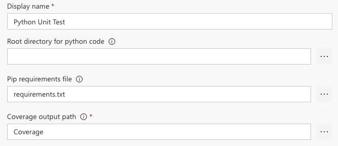
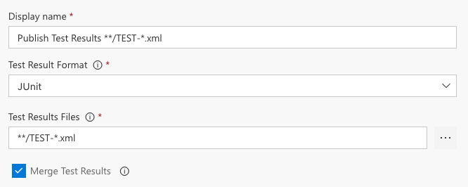
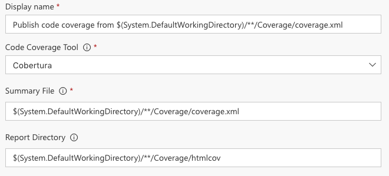

# Python unittest build extension

Execute your [Python 3](https://www.python.org) unit tests in Visual Studio Team Services and get your test results and coverage information as part of your build.

The task uses the Python [unittest-xml-reporting](https://github.com/xmlrunner/unittest-xml-reporting) and [coverage.py](https://bitbucket.org/ned/coveragepy) modules to execute the unit tests using test discovery. If you want to try and run this locally first to see if it works then, after installing the modules in your virtual environment, try executing the following.

```bash
$ coverage run -m xmlrunner discover

Running tests...
----------------------------------------------------------------------
....
----------------------------------------------------------------------
Ran 5 tests in 0.001s

OK

Generating XML report...

$ coverage html
```

## Configuring the task

The task takes 3 parameters, these being:

* Root directory - This is location within the code base for where the code base can be located, if it is not specified then it is assumed that the root of the source code is the location to work from
* Pip requirements - The optional path to a Pip requirements file enabling additional modules to be restored
* Coverage directory - This is the required output location for coverage information generated by the task. You will need this later if you use the [Publish code coverage results](https://www.visualstudio.com/docs/build/steps/test/publish-code-coverage-results) task.



The results from the unit tests are published in the JUnit XML format and so can be used with the Publish Test Results task.



The coverage results are compatible with Cobertura and an HTML report is generated as part of the task.

**N.B.** the task creates a simplified test results report because of an [issue](https://github.com/Microsoft/vsts-tasks/issues/3027) with Visual Studio Team Services when loading in CSS and JavaScript dependencies. The original report is available as `index_full.html` if the coverage report is downloaded.



## Requirements

Python 3 must be installed and be available in the PATH.

Whilst not tested specifically against Linux build agents, if you would like to try then you might also need to install the package appropriate for your distribution to make the venv module available.

If using the hosted build agents then you will need to check that you are using one which has Python 3 available (Hosted VS2017 for instance).

## Releases

Version | Description
------- | -----------
0.1.x   | Initial release targetting the execution of unit tests on Windows build agents